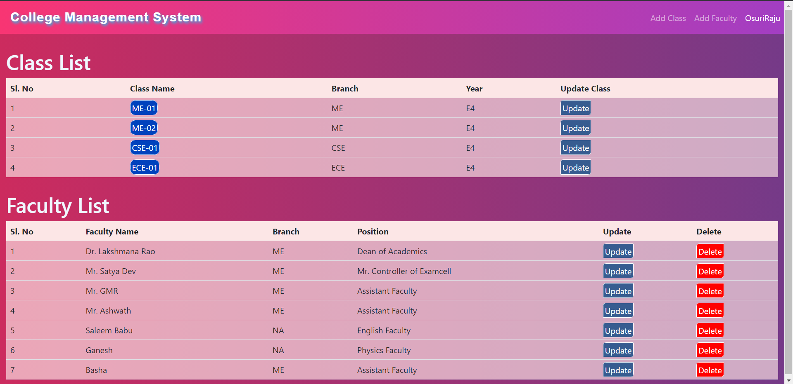
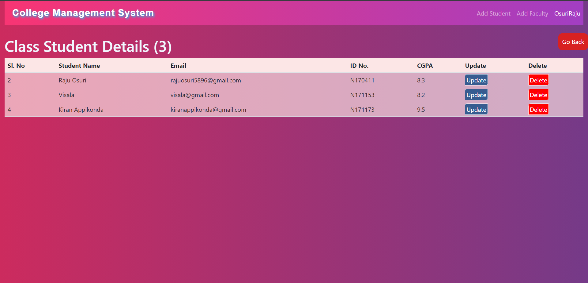
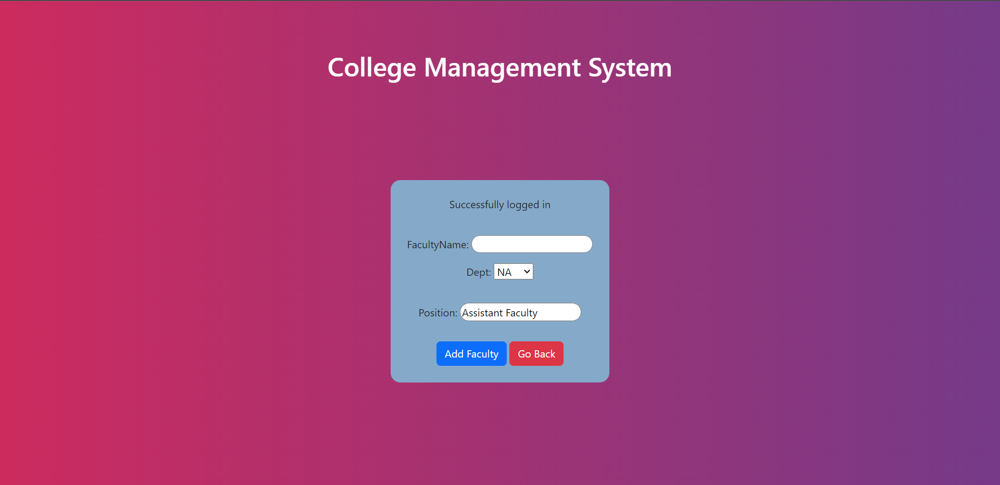
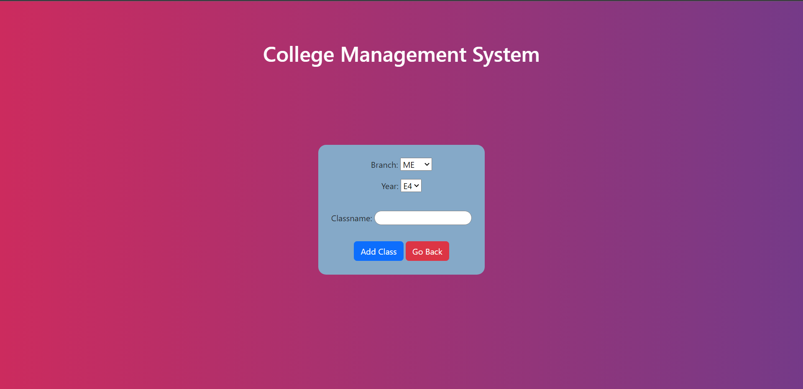

# College-Management-System
This is a project to manage all the Students, Faculties and Classes in a University or College.

<h2>Home Page</h2>

We can manage every class and faculties from the home page.

<h2>Class Page</h2>

We can add or remove students from the each class. The count of the students present in the class also represented in the top of the page.

<h2>Adding Faculty</h2>

We can add faculties with their position and department in the college. We can later update their details too.

<h2> Adding Classes</h2>

We can add classes by the branch names like this.

